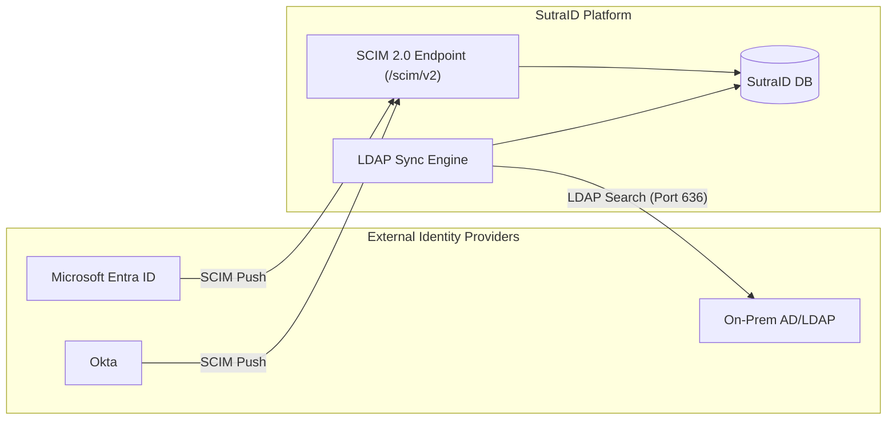

# SutraID Directory Integration Guide

This guide explains how to synchronize users and groups from external directories (Entra ID, Okta, Active Directory) into SutraID.

## Architecture Overview

SutraID provides two primary methods for directory integration:

1.  **SCIM 2.0 (Preferred)**: Inbound provisioning where the external IdP pushes changes to SutraID.
2.  **LDAP/AD Sync**: Outbound synchronization where SutraID periodically queries an on-prem LDAP/AD server.

## Option 1: SCIM 2.0 Inbound Provisioning

### 1. Generate SCIM Token
In the SutraID Admin Portal, navigate to **Settings > Directory Integration** and select **SCIM 2.0**. Click **Generate Token**.

### 2. Configure Entra ID / Okta
- **Tenant URL**: `https://api.sutraid.com/scim/v2/{your-org-id}`
- **Secret Token**: Use the token generated in Step 1.
- **Attributes**: Ensure `userName`, `emails[type eq "work"].value`, `name.givenName`, and `name.familyName` are mapped.

---

## Option 2: LDAP / Active Directory Sync

### 1. Prerequisites
- **LDAPS Mandatory**: Port 636 with a valid certificate.
- **Service Account**: A bind account with read permissions for the target Base DN.

### 2. Configuration
- **LDAP URL**: `ldaps://your-ad-server.com:636`
- **Base DN**: `dc=example,dc=com`
- **Bind DN**: `cn=SutraService,ou=ServiceAccounts,dc=example,dc=com`
- **User Filter**: `(objectClass=user)`
- **Group Filter**: `(objectClass=group)`

### 3. JIT Provisioning
Synced users are automatically enabled for OAuth 2.1 / OIDC login flows once the sync is active.

## Recommendations

- **Security**: Use SCIM 2.0 whenever possible handled over HTTPS with Bearer Token auth.
- **Legacy**: Use LDAP sync only for legacy read-only environments where inbound provisioning is not supported.
